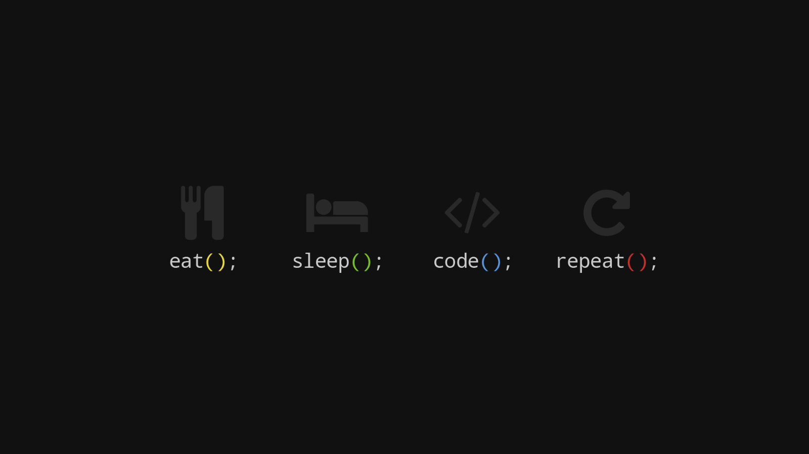

 

# 💫 About Me:
Computer Science / IT student focused on software and web development.  Strong foundation in Frontend (HTML, CSS, JavaScript) and backend development with PHP and MySQL. Experience with C# (OOP and application logic) and academic projects developed in C++. Worked with relational and non-relational databases including MySQL, MariaDB, and MongoDB.  Currently improving my skills in modern frameworks like Angular and TypeScript, while strengthening clean code practices and system design fundamentals.

## 🌐 Socials:
 

# 💻 Tech Stack:
                       
# 📊 GitHub Stats:
 
 

## 🏆 GitHub Trophies

### ✍️ Random Dev Quote

---

<!-- Proudly created with GPRM ( https://gprm.itsvg.in ) -->